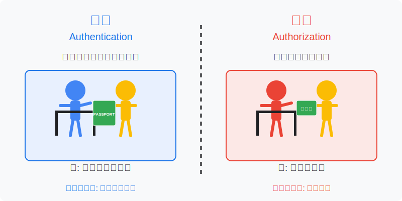
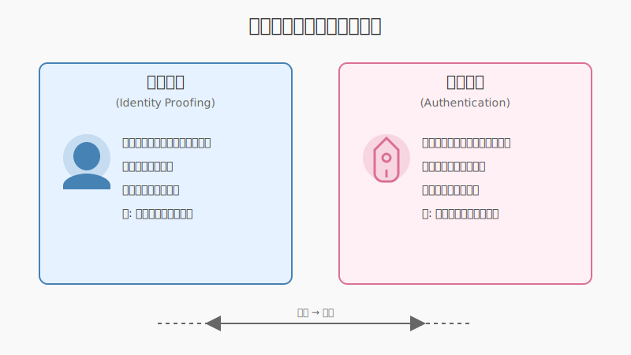

# 001 : そもそも認証認可とは

金融機関で働くAさんとBくんの対話を通して、認証の基本概念を学びます。認証とは何か、認証と認可の違い、身元確認と当人認証の違い、そして認証に対するセキュリティの考え方について解説します。近年増加している不正ログインや不正送金の問題にも触れながら、認証の重要性について理解を深めていきましょう。

## 📝 ① 認証とは何か
認証(Authentication)とは、「あなたが本当にあなたであることを確認するプロセス」のことです。デジタルの世界における身分証明書のような役割を果たします。オンラインサービスが増えるにつれて、適切な認証の仕組みがますます重要になっています。認証がなければ、オンラインでの安全な取引は成立しません。

💬   
Bくん：「Aさん、最近のニュースで楽天証券やSBI証券の不正取引の話を見ましたけど、なぜこういうことが起きるんですか？」

Aさん：「それは認証の仕組みに問題があったからだよ。認証とは『あなたが本当にあなたであることを確認するプロセス』のことなんだ。」

Bくん：「認証って、ユーザーIDとパスワードを入力することですよね？」

Aさん：「それも認証の一種だけど、認証の方法はそれだけじゃないんだ。例えば、ATMでキャッシュカードと暗証番号を使うのも認証だよ。デジタルサービスでは、ユーザーの顔が見えないから、何らかの方法で本人であることを確認する必要があるんだ。」

### 📌 ポイント
- 認証とは「あなたが本当にあなたであるか」を確認するプロセス
- IDとパスワード以外にも様々な形式の認証が存在する
- デジタルサービスでは、対面で確認できないため認証が特に重要

## 📝 ② 認証(Authentication)と認可(Authorization)の違い
認証は「誰であるか」を確認するプロセス、認可は「何ができるか」を決定するプロセスです。この二つは密接に関連していますが、全く異なる概念であり、セキュリティ設計では明確に区別する必要があります。適切な認証と認可の仕組みがあってこそ、安全なサービス提供が可能になります。

💬   
Aさん：「認証と似た言葉で『認可』っていう言葉を聞いたことがあるかな？」

Bくん：「なんとなく聞いたことはありますが...違いがよくわかりません。」

Aさん：「よく混同されがちだけど、実は全く異なる概念なんだ。簡単に言うと：

- **認証(Authentication)**: あなたが『誰であるか』を確認するプロセス
- **認可(Authorization)**: あなたが『何ができるか』を決定するプロセス」

Bくん：「具体的な例があると分かりやすいかも...」

Aさん：「空港を想像してみよう。パスポート確認は『認証』、搭乗券は『認可』の例だね。銀行アプリではログイン時のパスワードが『認証』、ログイン後に送金や照会などどの操作が許可されるかが『認可』というわけだ。」

### 📌 ポイント
- 認証：あなたが「誰であるか」を確認する
- 認可：あなたが「何ができるか」を決定する
- この二つを混同するとセキュリティ設計で問題を引き起こす可能性がある

## 📝 ③ 身元確認と当人認証の違い
認証の中でも「身元確認(Identification)」と「当人認証(Authentication)」は区別すべき重要な概念です。特に金融機関では、この区別を明確にすることがセキュリティと法令遵守の両面で不可欠となります。この二つは認証プロセスの異なる段階で行われ、それぞれ異なる目的を持っています。

💬   
Aさん：「認証の中でも、さらに二つの重要な概念があるんだ。『身元確認』と『当人認証』だよ。」

Bくん：「身元確認と当人認証...これも違うんですか？」

Aさん：「そうなんだ。この違いを理解することは、特に金融機関では非常に重要なんだよ。
- **身元確認(Identification)**: あなたが『誰なのか』を確立すること。本人確認や実在確認とも言われるよ。
- **当人認証(Authentication)**: 既に確立された身元に対して、『その人が本当にその本人なのか』を確認すること。」

Bくん：「具体的な例があると助かります。」

Aさん：「銀行口座を開設するとき、免許証などの公的書類を提示するのが『身元確認』、開設後の口座へのログイン時のパスワード入力が『当人認証』だね。eKYCでスマホで身分証と顔を撮影するのも『身元確認』の例だよ。」

### 📌 ポイント
- 身元確認：最初にあなたが誰かを確立するプロセス
- 当人認証：確立された身元と同一人物かを確認するプロセス
- 金融機関では、この二つを区別して適切なセキュリティレベルで実装する必要がある

## 📝 ④ 絶対に破られない認証はない
セキュリティの世界では、絶対に破られない認証は存在しません。重要なのは、破られる確率をできるだけ下げるアプローチです。完璧な防御を追求するのではなく、多層防御やリスクベースの考え方を取り入れることで、より現実的かつ効果的なセキュリティ対策が可能になります。

💬   
Aさん：「ここで一つ、非常に重要なことを理解しておく必要があるんだ。それは、『絶対に破られない認証は存在しない』ということだよ。」

Bくん：「え！そうなんですか？それじゃあ、どんなに対策しても無駄ってことですか？」

Aさん：「いや、そうじゃないんだ。認証のセキュリティは『破られる確率をできるだけ下げる』というアプローチで考える必要があるんだよ。例えば、4桁の暗証番号は最大で10,000通りしかないけど、複雑なパスワードや多要素認証を導入すれば、攻撃成功の確率を大幅に下げられる。」

Bくん：「なるほど...では、具体的にどうすれば良いんですか？」

Aさん：「セキュリティの世界では『多層防御』という考え方が重要なんだ。一つの防御策が破られても、次の防御策で止める。また、操作の重要度に応じて認証レベルを使い分けることも大切だよ。残高照会なら簡単な認証でも、高額送金には厳格な認証を要求する『リスクベース認証』の考え方だね。」

### 📌 ポイント
- 絶対に破られない認証は存在しない
- 目指すべきは「破られる確率を下げる」こと
- 多層防御の考え方が重要
- 操作の重要度に応じて認証レベルを使い分ける「リスクベース認証」

------------------------------------------------------------------------------------------

## まとめ
認証とは「あなたが本当にあなたであるか」を確認するプロセスです。認証と認可は別の概念であり、また身元確認と当人認証も区別して考える必要があります。セキュリティにおいて完璧な防御は存在せず、多層防御やリスクベースのアプローチが重要です。

### 📌📌今回のポイント📌📌
1. 認証と認可は別物：認証はあなたが誰かを確認、認可はあなたに何ができるかを決定
2. 身元確認と当人認証も区別が必要：身元確認は最初に誰かを確立、当人認証はその後に本人確認
3. 絶対に破られない認証はない：できるのは突破される確率を下げること
4. 多層防御とリスクベース認証が重要：複数の防御策と状況に応じた認証強度の選択
