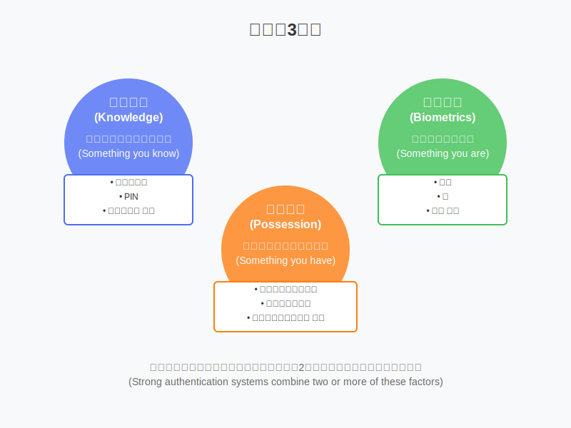

# 004 : 認証手段と多要素認証 (知識情報・所有情報・生体情報)

現代のデジタル社会では様々な認証手段が使われています。今回は認証手段を3つの種類（知識情報・所有情報・生体情報）に分けて説明し、それぞれの特徴と多要素認証の重要性について解説します。

## 📝 ① 認証の3要素とその特徴
認証方法は「知っていること」「持っているもの」「自分自身の特徴」という3つの要素に分類できます。これらはそれぞれ強みと弱みを持ち、組み合わせることで認証の強度を高められます。

💬   
Bくん：「認証方法って色々あると思うんですが、どのように分類するものなんですか？」

Aさん：「うん、認証方法は大きく3つのカテゴリに分けることができるよ。『知っていること（知識情報）』、『持っているもの（所有情報）』、そして『あなた自身の特徴（生体情報）』の3つだね。」

Bくん：「なるほど、3つに分けられるんですね。それぞれについて具体的に教えてもらえますか？」

Aさん：「もちろん！『知っていること』は、パスワードや暗証番号、秘密の質問への回答など、あなたの記憶の中にある情報を指すよ。『持っているもの』は、スマートフォン、ICカード、物理セキュリティキーなど、あなたが物理的に所持している物を使った認証方法だね。『あなた自身の特徴』は、指紋、顔、虹彩、声紋など、あなたの身体的特徴や行動パターンを利用するものさ。これら3つの要素はそれぞれ特性が異なるから、セキュリティと利便性のバランスを考えて選ぶ必要があるんだ。」

### 📌 ポイント
- 認証方法は「知識情報」「所有情報」「生体情報」の3要素に分類される
- 知識情報：パスワード、暗証番号、秘密の質問など記憶に基づく情報
- 所有情報：スマートフォン、ICカード、物理トークンなど物理的に所持するもの
- 生体情報：指紋、顔、虹彩など身体的特徴や行動パターン

## 📝 ② 知識情報による認証の種類と特徴
知識情報による認証は最も一般的な方法ですが、その実装方法によって安全性が大きく変わります。パスワードや暗証番号など、種類によって特性が異なり、目的に応じた選択が必要です。

💬   
Aさん：「まずは知識情報による認証について詳しく見ていこうか。これは『あなたが知っていること』で本人確認する方法だよ。」

Bくん：「知識情報って、パスワードとかのことですよね？他にどんな種類があるんですか？」

Aさん：「そうだね。知識情報による認証にはいくつか種類があるんだ：
- **パスワード**: 文字、数字、記号の組み合わせで、最も一般的な認証方法。CISAやセキュリティ専門家は12〜16文字以上を推奨しているよ。
- **PIN（暗証番号）**: 主に4桁の数字で、ATMやスマホのロック解除などに使われる。入力が簡単だけど、組み合わせは10,000通りしかないから安全性は低いんだ。
- **秘密の質問・回答**: 「最初に飼ったペットの名前は？」のような質問とその答え。パスワードリセット用として使われるけど、SNSなどから答えが推測されるリスクがあるよ。
- **パスフレーズ**: 複数の単語をつなげた長い文章。長さがあるから解読が難しく、覚えやすいという利点があるんだ。」

Bくん：「パスワードと暗証番号の違いってなんですか？どっちが安全なんですか？」

Aさん：「いい質問だね！パスワードと暗証番号（PIN）の主な違いは複雑さと長さなんだ。パスワードは通常、英字（大文字・小文字）、数字、記号を組み合わせた12文字以上の文字列で、可能な組み合わせは数兆通り以上になるよ。一方、暗証番号は通常4桁の数字だけで構成され、組み合わせは最大でも10,000通りしかない。

当然、パスワードの方が圧倒的に安全だけど、素早く入力する必要がある場面（ATMや店舗の決済など）では、利便性を重視して暗証番号が使われることが多いんだ。最近ではスマホのロック解除にも6桁以上の暗証番号を使うことが増えているよ。安全性を高めるには、誕生日や住所など推測されやすい数字は避けた方がいいね。」

### 📌 ポイント
- パスワード：英数字記号を組み合わせた12文字以上の文字列が推奨され、高い安全性を持つ
- PIN（暗証番号）：主に4〜6桁の数字で、利便性重視だが安全性は低い
- 秘密の質問：パスワードリセット用だが、SNSなどから情報が漏れるリスクがある
- パスフレーズ：単語を複数組み合わせた文章で、長さと覚えやすさを両立する

## 📝 ③ 所有情報による認証の種類と特徴
所有情報による認証は「あなたが持っているもの」を使って本人確認を行います。物理的なデバイスやカードから、スマートフォンに送られるコードまで、様々な形態があります。

💬   
Aさん：「次は所有情報による認証について見ていこう。これは『あなたが持っているもの』で本人確認する方法だよ。」

Bくん：「所有情報って具体的にはどんな種類があるんですか？スマホとか使うものですか？」

Aさん：「そう、スマホを使う方法もあるし、様々な種類があるんだ：
- **ワンタイムパスワード（OTP）**: 一度だけ使える使い捨てのパスワードで、主に以下の種類があるよ：
  - **SMS/メール型**: 携帯電話やメールに送られる数字コード
  - **TOTP型**: Google Authenticatorなどのアプリで生成される、30秒ごとに変わる数字
  - **ハードウェアトークン型**: RSA SecurIDなど専用デバイスが生成する数字
- **デバイス認証**: スマホやPCなど、特定のデバイス自体を信頼する方法
- **マイナンバーカード/運転免許証**: ICチップ搭載の公的身分証明書
- **セキュリティキー**: YubiKeyなどのUSB型物理デバイス」

Bくん：「ワンタイムパスワードってSMSで送られてくるやつですよね。種類によって安全性に違いはあるんですか？」

Aさん：「うん、種類によって安全性はかなり違うんだ。SMS型は手軽だけど、SIMスワップ攻撃（携帯電話会社をだまして電話番号を乗っ取る攻撃）に弱いんだよ。TOTP型はアプリで生成されるから、通信傍受のリスクがなく、オフラインでも使えるからSMSより安全と言えるね。最も安全なのはハードウェアトークンで、専用デバイスが生成するため、スマホのマルウェアなどの影響も受けにくいんだ。

最近注目されているのはFIDO準拠のセキュリティキーだね。YubiKeyなどがこれに当たるんだけど、フィッシング耐性が非常に高く、金融機関や企業の重要システムで採用が増えているよ。マイナンバーカードも電子証明書を使った高度な認証ができるから、これからの金融サービスでも活用が進みそうだね。」

### 📌 ポイント
- ワンタイムパスワード（OTP）：一度だけ使える使い捨てコードで、SMS型、アプリ型（TOTP）、ハードウェア型がある
- SMS型は手軽だが傍受リスクあり、TOTP型はオフラインでも使用可能でより安全
- セキュリティキー（YubiKeyなど）はフィッシング耐性が高く、最も安全な所有情報認証の一つ
- マイナンバーカードは電子証明書を使った公的な認証手段として注目されている

## 📝 ④ 生体情報による認証の種類と特徴
生体情報による認証は「あなた自身の特徴」を使って本人確認を行う方法です。指紋や顔など様々な身体的特徴を利用し、忘れたり紛失したりするリスクがない一方で、変更できないという課題もあります。

💬   
Aさん：「最後に生体情報による認証を見ていこう。これは『あなた自身の特徴』を使った本人確認だよ。」

Bくん：「スマホの指紋認証や顔認証が思い浮かびますが、他にもあるんですか？」

Aさん：「うん、スマホでよく使われる指紋や顔認証以外にもあるんだ：
- **指紋認証**: 最も普及している生体認証で、スマホやノートPCでよく使われているよ
- **顔認証**: iPhone FaceIDなどに代表される、顔の特徴点を使った認証
- **静脈認証**: 指や手のひらの静脈パターンを使った認証で、銀行ATMなどで使われることも
- **虹彩認証**: 目の虹彩のパターンを使った精度の高い認証方式
- **音声認証**: 声紋を使った認証方式で、電話銀行などで活用される場合も
- **体内埋め込みチップ**: RFIDチップを体内に埋め込む先進的な方法」

Bくん：「生体認証って便利そうですね！でも何か欠点はあるんですか？」

Aさん：「生体認証の最大の利点は、『忘れない』『紛失しない』という点だね。でも大きな欠点もあるんだ。最大の問題は、一度漏洩したり偽造されたりすると『変更できない』ことだよ。パスワードは流出したら変更できるけど、指紋は変えられないからね。

また、生体情報も完璧ではなくて、指紋認証は手が濡れていたり、怪我をしていたりすると認識しにくくなるし、顔認証は照明条件や顔の変化（髭、メイクなど）で影響を受けることがあるんだ。

それから、プライバシーの観点からも懸念があって、生体情報の保存方法や利用方法によっては個人情報保護の問題が生じる可能性もあるよ。だから多くのスマホでは、生体情報を端末の安全な領域（セキュアエンクレーブなど）に保存して、外部に送信しない設計になっているんだ。」

### 📌 ポイント
- 指紋認証：最も一般的だが、指の状態により認識率が変動する
- 顔認証：非接触で便利だが、環境条件に影響される
- 静脈認証・虹彩認証：偽造が難しく高セキュリティだが、専用装置が必要
- 生体認証の最大の欠点は「変更できない」こと
- プライバシーや情報保存方法の課題もある

## 📝 ⑤ 多要素認証の重要性と実装方法
多要素認証は複数の認証方法（特に異なるカテゴリから）を組み合わせることで、一つの方法の弱点を他の方法でカバーし、全体としてのセキュリティを高める手法です。

💬   
Aさん：「ここまでの話から分かるように、どの認証方法も単体では完璧ではないんだ。そこで登場するのが『多要素認証』だよ。」

Bくん：「多要素認証というのは、複数の認証方法を組み合わせるということですよね？具体的にはどんな組み合わせが一般的なんですか？」

Aさん：「その通り！多要素認証は、異なる種類の認証方法を2つ以上組み合わせることで、セキュリティを高める方法なんだ。
- **2要素認証（2FA）**: 最も一般的で、「知っていること」＋「持っているもの」の組み合わせが多いよ
- **3要素認証**: さらに「あなた自身の特徴」も加えた3つを使う方法だね

同じカテゴリから2つ選ぶより、異なるカテゴリから選ぶことが重要なんだ。例えば、パスワード2つより、パスワード＋スマホ認証の方が強力だよ。なぜなら、パスワードが漏洩しても、スマホを持っていない攻撃者はアクセスできないからね。」

Bくん：「なるほど、実際にはどんな組み合わせが使われているんですか？具体例を教えてもらえますか？」

Aさん：「よく使われている多要素認証の例を挙げるね：

1. **パスワード＋SMSワンタイムパスワード**：
   - Googleアカウント、Yahooアカウントなど多くのWebサービスで採用されてるよ
   - パスワードを入力した後、スマホにSMSで届くコードを入力する方式だね

2. **PIN＋指紋認証**：
   - iPhoneやAndroidでのロック解除や決済認証でよく使われてるよ
   - 指紋認証が失敗した場合のバックアップとしてPINも用意されているんだ

3. **パスワード＋セキュリティキー**：
   - Google、Microsoft、GitHubなど重要なサービスで採用されているよ
   - パスワードを入力した後、YubiKeyなどの物理キーをUSBポートに挿入する方式だね

4. **マイナンバーカード＋PIN＋生体認証**：
   - 政府のオンラインサービスや、今後の金融サービスでの活用が期待されてるよ
   - カード（所有）、PIN（知識）、指紋（生体）の3要素を使う強固な認証方式だね

銀行などの金融機関では、特に重要な取引（大額送金など）の際にのみ追加認証を求めるなど、リスクと利便性のバランスを取る工夫もされているよ。実際、不正ログインによる被害は年々増加していて、インターネットバンキングだけでも2023年には約80億円の被害が報告されているんだ。多要素認証の導入は単なる手間ではなく、こういった被害から自分を守るための重要な対策なんだよ。」

### 📌 ポイント
- 多要素認証は異なるカテゴリから複数の認証方法を組み合わせることでセキュリティを強化する
- 2要素認証（2FA）が最も一般的で、「知識＋所有」の組み合わせが多い
- 実装例：パスワード＋SMS、PIN＋指紋、パスワード＋セキュリティキーなど
- 金融機関では重要な取引のみ追加認証を求めるなど、リスクと利便性のバランスを考慮した実装も

------------------------------------------------------------------------------------------

## まとめ
今回は認証の3つの要素（知識情報・所有情報・生体情報）とそれぞれの特徴、そして多要素認証の重要性について学びました。どの認証方法も単体では完璧ではありませんが、異なる種類の認証方法を組み合わせることで、セキュリティを大幅に向上させることができます。

### 📌📌今回のポイント📌📌
1. 認証方法は「知っていること」「持っているもの」「あなた自身の特徴」の3種類に分類できる
2. 知識情報（パスワード、PIN等）は便利だが漏洩リスクがあり、12文字以上の長いパスワードが推奨されている
3. 所有情報（OTP、セキュリティキー等）は盗み見られにくいが紛失リスクがある
4. 生体情報（指紋、顔等）は忘れる・紛失のリスクはないが、変更できないという欠点がある
5. 多要素認証は異なる種類の認証方法を組み合わせることで、全体のセキュリティを高める

## 参考資料
[1] 金融庁「インターネットバンキングによる不正送金被害にご注意ください」 https://www.fsa.go.jp/ordinary/internet-bank_2.html  
[2] CISA「Require Strong Passwords」 https://www.cisa.gov/secure-our-world/require-strong-passwords  
[3] NIST「Strength of Passwords」 https://pages.nist.gov/800-63-4/sp800-63b/passwords/  
