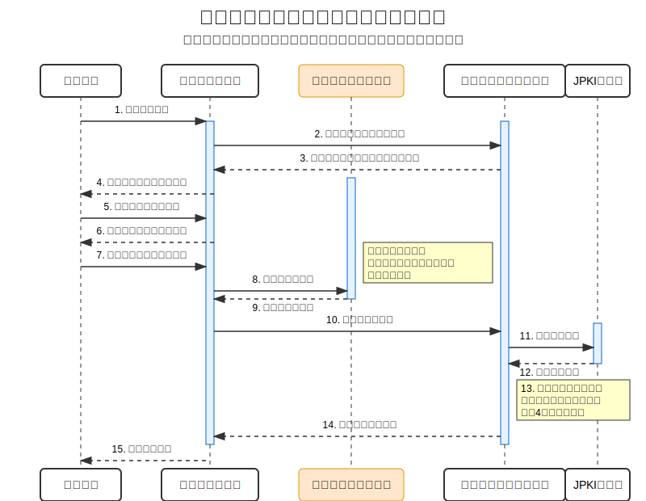

# 010 : これからの認証技術②(マイナンバーカードとJPKI)

今回は、日本の公的個人認証基盤であるJPKI（公的個人認証サービス）とマイナンバーカードを活用した認証技術について解説します。マイナンバーカードは単なる身分証明書ではなく、高度な電子認証機能を持つデジタルIDとしての側面を持っています。今回はその仕組みと活用方法について学んでいきましょう。

## 📝 ① マイナンバーカードに格納された2種類の電子証明書
マイナンバーカードには「署名用電子証明書」と「利用者証明用電子証明書」という2種類の電子証明書が格納されています。それぞれ異なる目的と特性を持ち、高度なデジタル認証の基盤となっています。

💬   
Bくん：「マイナンバーカードって、よく耳にするけど、認証の仕組みがあるって本当？どんな機能があるの？」

Aさん：「うん、マイナンバーカードには2種類の電子証明書が入ってるんだ。これがデジタル社会の本人確認の要になってるよ。一言でいうと、物理的な身分証明書の機能をデジタルでも使えるようにしたものなんだ」

Bくん：「2種類もあるの？何が違うんですか？」

Aさん：「大きく分けて『署名用電子証明書』と『利用者証明用電子証明書』があるんだ。署名用は基本4情報（氏名、住所、生年月日、性別）を含んでいて、本格的な身元確認に使えるよ。一方、利用者証明用は基本4情報を含まず、主にログイン（当人認証）に使われるんだ。要するに、署名用は『この人は〇〇さんです』という身元確認、利用者証明用は『前回来た人と同じ人です』という当人認証に使い分けるわけ」

### 📌 ポイント
- マイナンバーカードには「署名用電子証明書」と「利用者証明用電子証明書」の2種類がある
- 署名用は基本4情報（氏名、住所、生年月日、性別）を含み、身元確認に使用
- 利用者証明用は基本4情報を含まず、ログインなどの当人認証に使用
- 両電子証明書の有効期限は発行日から5回目の誕生日まで（約5年間）

## 📝 ② JPKIとは？公的個人認証の仕組み
JPKI（公的個人認証サービス）は、日本政府が提供する公的な電子認証の基盤です。マイナンバーカードに格納された電子証明書と、それを発行・管理する認証局から構成されています。

💬   
Aさん：「JPKIって聞いたことある？正式には『公的個人認証サービス』って言うんだけど」

Bくん：「なんとなく聞いたことはありますが...マイナンバーカードと関係あるんですか？」

Aさん：「そう、マイナンバーカードに入っている電子証明書を発行したり、その有効性を確認したりするシステム全体をJPKIって呼ぶんだ。具体的には以下の要素から成り立ってるよ：

- 認証局：地方公共団体情報システム機構（J-LIS）が運営
- 電子証明書：マイナンバーカードに格納されている証明書
- 利用者向けソフトウェア：証明書を使うためのアプリやライブラリ
- 制度的フレームワーク：電子署名法や公的個人認証法などの法的基盤」

Bくん：「なるほど。でもどうやって使うんですか？実際の認証のフローとか」

Aさん：「例えば、ある人がオンラインサービスで本人確認をする場合、大まかには次のようなプロセスになるよ：

1. サービスプロパイダーがチャレンジデータ（ランダムな値）を生成
2. ユーザーが端末に暗証番号を入力し、マイナンバーカードをかざす
3. カード内の電子証明書の秘密鍵を使ってチャレンジデータに電子署名
4. 署名されたデータと電子証明書がサービス提供者に送信
5. サービスプロパイダーがJ-LISに電子証明書の有効性を確認
6. 電子署名と電子証明書を検証して本人確認完了

このプロセスが、物理的な身分証明書の提示と同等の信頼性を持つ仕組みなんだ」

### 📌 ポイント
- JPKIは日本政府が運営する公的な電子認証基盤
- 認証局（J-LIS）、電子証明書、利用者ソフトウェア、法的枠組みで構成
- チャレンジレスポンス方式でなりすまし防止
- 民間事業者も認定を受ければJPKIを活用可能

## 📝 ③ 犯収法のワ方式と実用例
犯収法（犯罪収益移転防止法）における「ワ方式」は、マイナンバーカードの署名用電子証明書を使った本人確認方法です。オンラインでの非対面取引において、高いセキュリティレベルの本人確認を可能にします。

💬   
Bくん：「犯収法の"ワ方式"ってよく聞くけど、これもマイナンバーカード関連？」

Aさん：「そうだよ。犯収法では本人確認の方法がイ～ワまでアルファベットで分類されていて、『ワ方式』はマイナンバーカードの署名用電子証明書を使った最も信頼性の高い方法なんだ。銀行口座開設やオンライン証券の口座開設などで使われることが増えてきてるよ」

Bくん：「具体的にどんなところで使われてるんですか？」

Aさん：「実際のユースケースをいくつか挙げると：

- オンラインバンキングの口座開設：一部の銀行では、来店不要でスマホとマイナンバーカードだけで口座開設できるサービスを提供してるよ
- 証券口座開設：主要なネット証券各社が対応を進めてる
- 携帯電話契約：一部のキャリアでは本人確認手段として採用
- 公金受取口座の登録：マイナポータルから還付金などの受取口座を登録する際に使用
- 電子契約：不動産契約などでも活用され始めている

これらはすべて、従来は対面や書類のやり取りが必要だった手続きをオンラインで完結できるようにしたものなんだ」

### 📌 ポイント
- ワ方式は犯収法における非対面本人確認方法の一つで、最も信頼性が高い（IAL3相当）
- 署名用電子証明書を使うことで、対面と同等の本人確認がオンラインで可能に
- 金融機関の口座開設、携帯電話契約、電子契約など様々な場面で活用
- 民間事業者が活用するには、認定事業者になるか認定プラットフォーム事業者と連携する必要がある

## 📝 ④ スマホでのマイナンバーカード活用と今後の展望
近年、マイナンバーカードの機能をスマートフォンに搭載する取り組みが進んでいます。これにより、物理カードを持ち歩かなくても、電子証明書の機能が利用できるようになってきています。

💬   
Aさん：「最近の動きとして、マイナンバーカードの機能をスマホに入れられるようになってきてるんだ。これが普及すると、カードを持ち歩かなくてもスマホだけで本人確認ができるようになるよ」

Bくん：「それって便利ですね！でも、セキュリティ的にはどうなんですか？」

Aさん：「いい質問だね。スマホ搭載の場合、セキュアエレメントという特殊な保護領域に電子証明書の情報が保存されるんだ。ただ、物理カードのように取り外せないため、スマホ自体が盗まれた場合のリスクはあるね。

技術的には、スマホ版は基本的にAAL2（高い保証レベル）に該当する可能性が高いとされていて、カード本体のAAL3（最高レベル）よりは若干下がる可能性があるんだ。その理由は、すべてのスマホがFIPS認証相当の厳格なセキュアエレメントを搭載しているわけではないからなんだ」

Bくん：「将来的にはどう発展していくと思いますか？」

Aさん：「今後の展望としては、いくつかの方向性が考えられるよ：

1. **パスキーとの連携**: マイナンバーカードを使った高度な身元確認を一度行い、日常的な認証にはより使いやすいパスキーを使うという組み合わせ

2. **リカバリー手段としての活用**: パスキーを紛失した場合の強力なリカバリー手段として、マイナンバーカードによる本人確認を使う

3. **Banking as a Service (BaaS)への応用**: 銀行APIを外部に公開する際の強固な認証基盤として活用

4. **デジタル完結型サービスの拡大**: 保険、不動産、医療など、従来は対面が必須だった分野でのオンライン完結型サービスが増加」

### 📌 ポイント
- マイナンバーカードの機能をスマホに搭載する取り組みが進行中
- スマホ版は利便性向上が見込まれるが、セキュリティレベルはカード本体よりやや低下する可能性
- パスキーとの連携により、高セキュリティと高利便性を両立させる方向性が有望
- 様々な業界でデジタル完結型サービスの基盤として活用される可能性

## 📝 ⑤ 次期マイナンバーカードが目指す2026年の変革
現行のマイナンバーカードは2016年に交付が開始されてから約10年が経過し、初期に発行されたカードが2026年頃に更新時期を迎えます。これに合わせてデジタル庁は「次期マイナンバーカード」の開発を進めており、デザインや機能面で大きな変更が予定されています。

💬   
Bくん：「2026年に新しいマイナンバーカードが登場するって本当ですか？どう変わるんですか？」

Aさん：「うん、デジタル庁が『次期マイナンバーカード』の開発を進めていて、2026年度中の導入を目指してるんだ。2016年に最初のマイナンバーカードが発行されて10年が経過するから、更新のタイミングに合わせた形だね」

Bくん：「具体的にはどんな点が変わるんですか？」

Aさん：「大きく4つのポイントで変更が予定されてるよ。

まず1つ目は、券面デザインと記載事項の変更だね。性別については券面からは削除される予定で、ICチップ内の情報としては残るけど見た目には表示されなくなる。プライバシーへの配慮からの変更だね。

2つ目は、暗号方式の強化。現在のRSA暗号方式からECDSA（楕円曲線）暗号方式に変更する方向で検討されているよ。これは将来的な量子コンピュータによる解読リスクにも対応するためだね。

3つ目は、電子証明書の有効期限が現行の5年から10年に延長される予定。18歳未満は引き続き5年のままだけど、10年間の有効期間に耐えられる強固な暗号技術が採用されるんだ。

4つ目は、現行カードでは4種類ある暗証番号が2種類に再編される点。アプリケーションも整理されて、4桁と6桁以上の2つの暗証番号で済むようになる予定だよ。特に署名用の暗証番号で券面事項入力補助データにもアクセスできるようにして、暗証番号入力の負担を減らすんだ」

### 📌 ポイント
- 2026年度中に導入予定の次期マイナンバーカードは、初期発行カードの更新時期に合わせて開発が進められている
- 性別表記の券面からの削除や、デザインの刷新が計画されている
- 暗号方式はRSAからECDSA（楕円曲線）暗号に強化され、電子証明書の有効期限は10年に延長予定
- 暗証番号が4種類から2種類に再編され、ユーザーの利便性が向上する
- スマホでのICチップ情報読み取りを可能にするAPIの公開も検討されている

## 現行マイナンバーカードと次期マイナンバーカードの比較

| 項目 | 現行マイナンバーカード | 次期マイナンバーカード（2026年予定） |
|------|------------------------|----------------------------------|
| **券面デザイン** | 現行デザイン | 新デザイン（色や柄、レイアウトの調整） |
| **券面記載事項** | 氏名、住所、生年月日、性別、個人番号、顔写真など | 性別の記載が**削除**（ICチップ内には情報として保持） |
| **暗号方式** | RSA暗号方式 | ECDSA（楕円曲線）暗号方式 |
| **電子証明書有効期限** | 5年間 | **10年間**（18歳未満は引き続き5年） |
| **カード本体有効期限** | 発行から10回目の誕生日まで（約10年） | 変更なし（約10年） |
| **アプリケーション(AP)数** | 4つのAP（複雑な構成） | **2つに再編**（よりシンプルな構成） |
| **暗証番号の数** | 4種類の暗証番号 | **2種類に削減**（4桁と6桁以上の2つ） |
| **署名用暗証番号** | 6～16桁の英数字 | 同様だが、券面事項入力補助データへのアクセスにも使用可能 |
| **照合番号** | 現行形式 | 6桁の読み取りやすい番号に変更 |
| **ICチップAPI公開** | 限定的（一部企業のみ） | より広範なAPI公開を検討中 |
| **スマホ対応** | Androidのみ対応（2023年5月～） | Android + iOS対応（iPhone対応は2025年春後半頃予定） |
| **主な目的** | - | 偽造防止強化、プライバシー配慮、暗号セキュリティ向上、ユーザー利便性向上 |

------------------------------------------------------------------------------------------

## まとめ
マイナンバーカードとJPKIは、日本のデジタル社会における本人確認・認証の基盤として重要な役割を果たしています。署名用と利用者証明用の2種類の電子証明書は、それぞれ身元確認と当人認証という異なる目的に対応しており、犯収法のワ方式のような実用的な形で既に様々なサービスに取り入れられています。また、スマホへの機能搭載やパスキーとの連携などにより、今後さらに利便性が向上することが期待されます。

さらに2026年に予定されている次期マイナンバーカードでは、電子証明書の有効期限延長や暗証番号の削減など、利用者の利便性向上と最新技術によるセキュリティ強化が図られる予定です。重要なのは、単なる「マイナンバー」の管理ツールではなく、強力な「デジタルID」として活用できる点です。

### 📌📌今回のポイント📌📌
1. マイナンバーカードには「署名用電子証明書」と「利用者証明用電子証明書」の2種類があり、それぞれ身元確認と当人認証という異なる目的に使用される
2. JPKIは認証局、電子証明書、利用者ソフトウェア、法的枠組みで構成される公的な電子認証基盤
3. 犯収法のワ方式は、マイナンバーカードの署名用電子証明書を使った高セキュリティの本人確認方法
4. マイナンバーカードの機能のスマホ搭載やパスキーとの連携により、高セキュリティと高利便性の両立が期待される
5. 2026年に予定される次期マイナンバーカードでは、電子証明書の有効期限延長（5年→10年）や暗証番号の削減（4種類→2種類）などの改良が行われる

## 参考資料
[1] マイナンバーカード普及推進サイト 「マイナンバーカードの電子証明書について」  
[2] 地方公共団体情報システム機構 「公的個人認証サービスポータルサイト」  
[3] 金融庁 「犯罪収益移転防止法におけるオンラインでの本人確認方法」  
[4] デジタル庁 「次期個人番号カードタスクフォース（第4回）」資料（2024年3月18日開催）  
[5] 「次期マイナンバーカードとは？最新動向解説｜2026年度導入を目指す方針」（2024年4月3日更新）  
[6] 「デジタル社会の実現に向けた重点計画」（2023年6月）  
