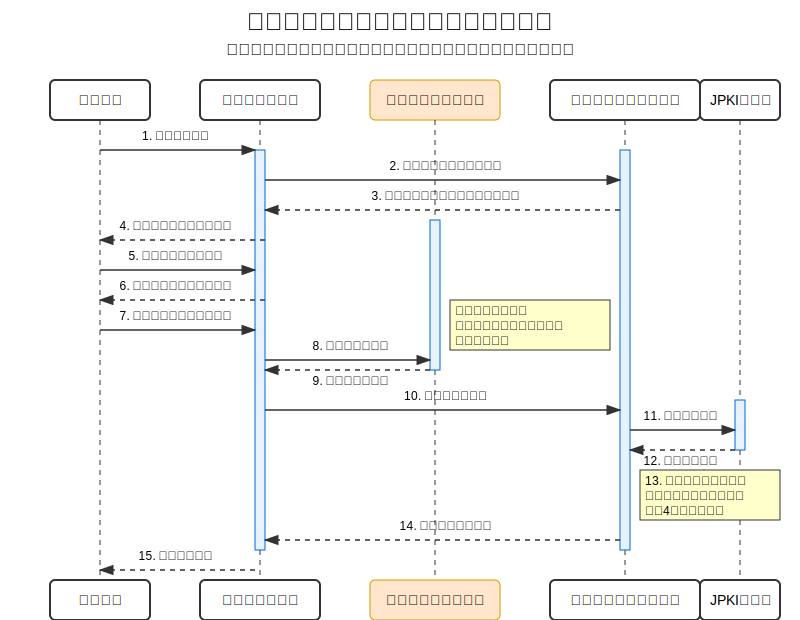

# **デジタル本人確認の動向と金融業界へのインパクト**

## **1. はじめに**

### **1.1. なぜ今、デジタル本人確認が重要か？**

* **非対面取引の拡大・高度化:** オンラインでの金融サービス利用が当たり前になり、安全かつ利便性の高い本人確認が不可欠。
* **マネー・ローンダリング及びテロ資金供与対策 (AML/CFT) の強化:**
    * **AML/CFTとは:** Anti-Money Laundering / Combating the Financing of Terrorism の略。犯罪組織やテロリストが不正な資金を合法的な資金に見せかける（マネー・ローンダリング）ことや、テロ活動のための資金調達を防ぐための国際的な取り組み。
    * **FATF（金融活動作業部会）からの国際的な要請:**
        * **FATFとは:** 1989年のアルシュ・サミットで設立された政府間機関。AML/CFTに関する国際基準（FATF勧告）を策定し、各国の遵守状況を相互審査。日本も加盟国。
        * **FATF勧告:** 各国が実施すべき対策の基準。「40の勧告」とテロ資金供与対策に関する「特別勧告」からなる。金融機関等による顧客管理（CDD: Customer Due Diligence、本人確認を含む）、疑わしい取引の届出（STR: Suspicious Transaction Reporting）、記録保存義務などを求めている。（※後述の「依拠」に関する勧告17も参照）
        * **第4次対日相互審査 (2021年公表):** 日本のAML/CFT体制について、法制度の整備は進んでいるものの、リスクベース・アプローチの実施や実効性の面で課題があると指摘。金融機関等における更なる態勢強化が求められている。
    * **金融庁「マネロン・テロ資金供与対策に関するガイドライン」による厳格化:** FATF勧告等を踏まえ、金融機関に対し、リスクベースでの継続的な顧客管理（Ongoing Due Diligence）の強化などを求めている（2024年3月までの対応完了を要請済み）。
* **顧客体験 (UX) 向上とデジタルトランスフォーメーション (DX) 推進:** スムーズな本人確認は顧客満足度向上と業務効率化に直結。
* **新しい技術・脅威への対応:** フィッシング詐欺の巧妙化、なりすまし技術の進化（ディープフェイク等）、本人確認書類の偽造など、常に最新の動向に対応する必要性。

### **1.2. 本勉強会の目的とゴール**

* **目的:**
    * デジタル本人確認に関する基礎知識、関連法規（特に犯収法）、主要な手法（ワ方式等）を理解する。
    * 本人確認の信頼性レベル（IAL, AAL, FAL）の概念と変遷を把握する。
    * 現行ガイドライン（OpenID F. J.）と最新の改定動向（デジタル庁）を理解する。
    * 「身元確認結果の活用（依拠/フェデレーション）」等の新しい潮流を知り、自社業務への応用可能性を探る。
* **ゴール:** 最新動向を理解し、自社の業務プロセス、リスク管理、システム戦略への影響と対応方針を考えるきっかけとする。

## **2. デジタル本人確認の基礎**

### **2.1. 「本人確認」とは？ ～2つのフェーズ～**

OpenID F. J. ガイドラインやデジタル庁改定案に基づき、本人確認は以下の2つの要素に分けて考えます。

* **身元確認 (Identity Proofing):**
    * **目的:** 申請者が「**実在**し、かつ名乗っている本人であるか」を確認する。
    * **タイミング:** 主に初回登録時（口座開設、契約時など）。
    * **確認内容例:** 本人確認書類の真正性確認、申告内容との照合。
* **当人認証 (Authentication):**
    * **目的:** サービス利用者が「以前**身元確認**した本人と**同一人物**であるか」を確認する。
    * **タイミング:** 主に2回目以降（ログイン、取引実行時など）。
    * **確認内容例:** パスワード、生体情報、OTPなどとの照合。

### **2.2. 金融機関における重要性**

* 金融機関では、AML/CFT、顧客資産保護、金融システムの信頼性維持の観点から、特に厳格な「身元確認」が求められます。

## **3. 関連法規：犯罪収益移転防止法（犯収法）**

### **3.1. 犯収法の目的と概要**

* **目的:** マネー・ローンダリング（資金洗浄）及びテロ資金供与の防止。FATF勧告など国際的な要請に対応。
* **対象事業者（特定事業者）:** 金融機関、ファイナンスリース業者、クレジットカード事業者、宅地建物取引業者、宝石・貴金属等取扱事業者、士業者（弁護士、司法書士、行政書士、公認会計士、税理士等）、暗号資産交換業者などが含まれる。
* **主な義務:**
    * **取引時確認:** 特定の取引（特定取引）を行う際に、顧客の本人特定事項（氏名、住居、生年月日等）、取引目的、職業/事業内容、実質的支配者等を確認する義務。
    * **確認記録の作成・保存:** 取引時確認の内容を記録し、一定期間（取引終了日から7年間）保存する義務。
    * **疑わしい取引の届出:** マネロン等が疑われる取引を検知した場合、速やかに行政庁（金融機関の場合は金融庁）に届け出る義務。

### **3.2. 取引時確認における本人特定事項の確認（非対面）**

非対面取引における本人特定事項の確認方法として、犯収法施行規則第6条第1項第1号に以下の方法（イ～ワ）が規定されています。**特にホ・ヘ・ト・ワ方式はeKYC（electronic Know Your Customer）** と呼ばれ、オンライン完結型の代表的な手法です。

* **（イ）書類送付＋転送不要郵便:** 本人確認書類（原本or写し）の送付を受け、転送不要郵便で文書を送付。
* **（ロ）書類送付（2種）:** 本人確認書類（原本or写し）の送付を2種類受ける、または1種類＋補完書類の送付を受ける。
* **（ハ）特定認証業務:** 電子署名法に基づく特定認証業務の電子証明書を利用。
* **（ニ）預貯金口座への振込:** 顧客名義の預貯金口座へ少額を振り込み、取引記録等を確認。
* **（ホ）写真付き書類画像＋容貌画像 (eKYC):** 写真付き本人確認書類の画像（表面・裏面・厚み）と本人の容貌画像の送信を受ける。
* **（ヘ）ICチップ情報＋容貌画像 (eKYC):** 写真付き本人確認書類のICチップ情報と本人の容貌画像の送信を受ける。
* **（ト）ICチップ情報＋銀行等照会/振込 (eKYC):** 写真付き本人確認書類のICチップ情報送信＋銀行等への顧客情報照会、またはICチップ情報＋顧客名義口座への振込。
* **（ワ）公的個人認証（署名用電子証明書）(eKYC):** マイナンバーカードの署名用電子証明書を利用。

※金融機関はこれらのいずれか、または複数の方法を組み合わせて取引時確認を行う必要があります。

## **4. 現行ガイドライン：OpenID F. J. 「民間事業者向けデジタル本人確認ガイドライン」**

### **4.1. 概要と位置づけ**

* **発行主体:** OpenID F. J. KYCワーキンググループ (2023年3月発行)。
* **対象:** 主に法令等で本人確認の定めがない**民間事業者**。
* **目的:** 事業者がサービスリスク等に応じて適切な本人確認手法を選択するための**ガイドブック**。規制ではない。
* **特徴:** スライド形式で読みやすく、手法例やユースケースが豊富。

### **4.2. 保証レベルの考え方 (NIST SP 800-63-3 / 行政手続ガイドライン準拠)**

* **保証レベルとは:** 本人確認の信頼性（確からしさ）を示す段階的なレベル。
* **IAL (Identity Assurance Level):** 身元確認保証レベル。申請者が実在し、主張する本人であることの確からしさ。
* **AAL (Authenticator Assurance Level):** 当人認証保証レベル。サービス利用者が以前身元確認した本人と同一人物であることの確からしさ。
* **FAL (Federation Assurance Level):** 認証連携（フェデレーション）の保証レベル。IDプロバイダと依拠当事者間で認証情報や属性情報を安全に連携する際の確からしさ。

**NIST SP 800-63-3 / 行政手続ガイドラインに基づく保証レベル (OpenID F. J. ガイドライン参照)**

| 保証レベル | IAL (身元確認) | AAL (当人認証) | FAL (認証連携) |
| :--------- | :------------- | :------------- | :------------- |
| **レベル3** | 対面での身元確認 | 多要素認証（耐タンパ性HWトークン必須） | 認証結果データへの署名・暗号化、鍵の本人所有証明連携 |
| **レベル2** | 遠隔または対面での身元確認 | 多要素認証 | アカウント発行元による署名・暗号化された認証結果データ連携 |
| **レベル1** | 身元確認なし（自己表明） | 単要素認証（または多要素認証） | アカウント発行元による署名付き認証結果データ連携 |

**行政手続（個人）に係る本人確認手法例と保証レベル（OpenID F. J. ガイドライン p.38より）**

| 必要な保証レベル | IAL | AAL | 本人確認全体の保証レベル (目安) | オンラインによる手法例 |
| :------------- | :-- | :-: | :-------------------------- | :------------------- |
| レベルA | 3 | 3 | 高 | ・マイナンバーカード（署名用電子証明書）で身元確認したアカウントに対し、マイナンバーカード（利用者証明用電子証明書）で当人認証 ・申請データにマイナンバーカード（署名用電子証明書）で電子署名を付与 |
| レベルB | 2 | 2 | 中 | ・マイナンバーカード（署名用電子証明書）等で身元確認したアカウントに対し、マイナンバーカード（利用者証明用電子証明書）またはその他の多要素認証（ID/PW＋OTP等）で当人認証 |
| レベルC | 1 | 1 | 低 | ・身元確認なしで作成したアカウントに対し、単要素認証（ID/PWのみ等）で当人認証 |
| レベルD | \- | \- | なし | ・身元確認なしで作成したアカウントに対し、当人認証を行わない |

* **DADC IALの参照:**
    * **背景:** 行政手続ガイドラインのIAL2には強度の異なる手法（例: アップロードと犯収法ホ方式）が混在するため、より詳細な強度比較が困難でした。
    * **DADC IALとは:** 経済産業省IPAのDADCが、IAL2を中心に身元確認手法の強度を細分化した指標（0〜4の5段階）。「情報の正確性（Information Assurance）」と「本人確認書類と本人の紐付けの確実性（Binding Assurance）」の観点から評価。
    * **本ガイドラインでの扱い:** 参考情報として紹介し、手法選択の判断材料を提供。
        * DADC IAL 0: 自己申告 (IAL1相当)
        * DADC IAL 1: アップロード (IAL2相当)
        * DADC IAL 2: リアルタイム撮影 (IAL2相当)
        * DADC IAL 3: 犯収法ホ/ヘ/ト方式、ホ方式自動化、身元確認結果活用 (IAL2相当)
        * DADC IAL 4: 公的個人認証(署名用) (IAL3相当)
* **考慮点:** 本人確認全体の強度はIALとAALの組み合わせで決まる。ユーザビリティやコストも重要。

### **4.3. 関連法規と本人確認書類**

* 犯収法、携帯電話不正利用防止法、古物営業法、番号法、個人情報保護法等に言及。
* マイナンバーカード、運転免許証、パスポート等の特徴を解説。

#### **4.3.1. マイナンバーカードの詳細**

マイナンバーカードは、デジタル社会の基盤として重要な役割を担う本人確認書類です。

* **ICチップ搭載アプリケーション:**
    * **公的個人認証 (JPKI) AP:** 電子証明書（署名用・利用者証明用）を格納。オンラインでの本人確認や電子署名に利用。
    * **券面AP:** 券面情報（氏名、住所、生年月日、性別、顔写真等）の画像データを格納。
    * **券面事項入力補助AP:** 券面情報（マイナンバー含む）をテキストデータで格納。各種申請時の入力補助に利用。
    * **住基AP:** 住民票コードをテキストデータで格納。
    * **空き領域:** 地方公共団体や国のアプリ（例: 健康保険証機能）を搭載可能。
    * **セキュリティ:** 税や年金などのプライバシー性の高い情報は格納されません。パスワードの入力間違いによるロック機能、不正読み出し時の自動破壊機能などがあります。
* **電子証明書:**
    * **署名用電子証明書:**
        * **用途:** e-Tax等での電子申請、オンラインでの契約締結など、「作成・送信した電子文書が、利用者が作成した真正なものであり、利用者が送信したものであること」を証明。**身元確認 (IAL3)** に利用可能。
        * **パスワード:** 6～16桁の英数字。
        * **記録情報:** 氏名、住所、生年月日、性別。
        * ワ方式のシーケンス
          
    * **利用者証明用電子証明書:**
        * **用途:** マイナポータルへのログイン、コンビニでの証明書交付など、「ログインした者が、利用者本人であること」を証明。**当人認証 (AAL3)** に利用可能。
        * **パスワード:** 4桁の数字。
        * **記録情報:** なし（本人であることを証明する情報のみ）。
* **スマートフォンへの電子証明書機能搭載（スマホ用電子証明書）:**
    * **目的:** マイナンバーカードを持ち歩かなくても、スマートフォンだけで各種オンラインサービスを利用可能に。
    * **現状:** Android端末向けに2023年5月よりサービス開始。iPhoneはiOS18.5に対応予定。
    * **搭載機能:** 署名用・利用者証明用の両電子証明書。
    * **認証:** 利用者証明用電子証明書は、スマートフォンの生体認証（顔・指紋等）や画面ロック解除で利用可能になる見込み。署名用は別途パスワード入力が必要。
    * **保証レベル:** マイナンバーカードと同等のIAL3/AAL3を目指して設計。
    * **発行・管理:** マイナポータルアプリ経由でオンライン発行・更新・失効が可能。

### **4.4. 主な身元確認手法（犯収法との関連含む）**

現行ガイドラインで紹介されている主な手法と保証レベルの目安です。（※「身元確認結果の活用」は、他社の確認結果に依拠する考え方であり、後述の「6.4.」で詳述します。）

| 手法例 | IAL | DADC IAL | 犯収法 | 主な特徴・留意点 |
| :----- | :-: | :------: | :----: | :--------------- |
| 自己申告 | 1 | 0 | \- | 最も簡易。虚偽リスク高。 |
| 本人確認書類アップロード | 2 | 1 | \- | 簡易だが画像加工・なりすましリスク高。 |
| 本人確認書類リアルタイム撮影 | 2 | 2 | \- | 偽造耐性向上。なりすましリスク残る。 |
| 顔写真付き書類(表裏)＋容貌撮影 | 2 | 2 | \- | なりすまし耐性向上。厚み確認なし。 |
| 犯収法ホ方式 | 2 | 3 | ホ | 書類(表裏厚み)+容貌撮影。撮影負荷大。目視確認要。 |
| ホ方式の自動化 | 2 | 3 | \- | ホ方式の目視確認をAIで自動化。リードタイム短縮。**犯収法要件は満たせない**。 |
| 犯収法ヘ方式 | 2 | 3 | ヘ | ICチップ+容貌撮影。券面偽造リスク低。暗証番号要。目視確認要。 |
| 犯収法ト方式 | 2 | 3 | ト | ICチップ/画像+他社(銀行等)確認。容貌撮影不要。対応サービス限定。 |
| **身元確認結果の活用** | **≧2** | **≧3** | **※** | **他社確認結果活用(API連携等)。書類撮影不要で利便性高。依拠元による。情報の鮮度に留意。（詳細は6.4）** |
| 公的個人認証（署名用）/ 犯収法ワ方式 | 3 | 4 | ワ | マイナンバーカード電子証明書。最高レベル。暗証番号要。即時確認可。 |

※犯収法では、限定的な条件下（委託、決済連携）で他の特定事業者の確認結果への依拠（特例）が認められています。OpenID F. J.の「身元確認結果の活用」は、より広範な技術的連携（OpenID Connect等）を想定した概念です。

### **4.5. 主な当人認証手法**

| 手法例 | AAL | 認証要素 | 主な特徴・留意点 |
| :----- | :-: | :------- | :--------------- |
| パスワード | 1 | 記憶 | 一般的。リスト型攻撃・フィッシングに脆弱。 |
| パスワード＋OTP | 2 | 記憶＋所持 | 2要素認証。フィッシング耐性は低い場合あり。 |
| パスワードレス生体認証(FIDO/パスキー) | ≧2 | 生体＋所持 | 利便性とセキュリティ両立。フィッシング耐性高。リカバリ課題。 |
| セキュリティキー認証(FIDO) | 3 | 生体/記憶＋所持 | 最高レベル。専用デバイス要。フィッシング耐性高。 |
| 公的個人認証（利用者証明用） | 3 | 記憶＋所持 | 最高レベル。マイナンバーカード＋暗証番号要。フィッシング耐性高。 |

### **4.6. 中間的な手法**

* **ホ方式の自動化:** 事業者の審査負荷軽減。
* **身元確認結果の活用（依拠）:** ユーザーの負担軽減、プライバシー向上。OpenID Connect等の技術活用。（詳細は6.4）

### **4.7. 事業者・個人情報の留意点**

#### **4.7.1. eKYC導入時の検討事項**

* **手法選択:** サービスリスク、ターゲット顧客層、利用可能な本人確認書類、ユーザビリティ、コストを総合的に評価。
* **ユーザーエクスペリエンス (UX):**
    * **実施完了率の最大化:** 機会損失を最小限に抑えるため、完了率を意識した設計が重要。
        * **実施完了率 = 本人確認書類カバー率 × 本人確認書類提出完了率 × 身元確認承認率**
        * **カバー率向上:** 広く利用される書類（運転免許証、マイナンバーカード等）や複数の書類に対応。
        * **提出完了率向上:** 分かりやすいUI/UX、撮影ガイド、FAQ提供、入力不備チェック。
        * **承認率向上:** 審査基準の明確化、画像鮮明化技術、AIによる自動チェック導入（ホ方式自動化など）。
    * **離脱ポイントの把握:** 手法ごとに離脱しやすいポイント（書類準備、撮影ステップ数、暗証番号忘れ等）を理解し、対策（複数手法の組み合わせ、丁寧なガイド等）を講じる。
* **システム構築・改修:** 自社開発、外部委託、API連携（eKYCベンダー利用）のメリット・デメリットを比較検討。API連携の場合も、責任主体は導入事業者である点に留意。
* **ユーザーへの事前周知:** 導入目的、手順、所要時間、個人情報の取り扱いについて、透明性を持って丁寧に説明。サービスの信頼性向上にも繋がる。
* **運用・セキュリティ体制:** システム不具合対応、不正アクセス対策、インシデント対応（個人情報漏洩等）、問い合わせ対応の体制整備。外部委託も選択肢。

#### **4.7.2. 個人情報の取扱い**

eKYCでは機微な個人情報を取り扱うため、個人情報保護法の遵守が不可欠です。

* **利用目的の特定・通知・公表 (法17, 18, 21条):** 本人確認に必要な範囲で利用目的を特定し、プライバシーポリシー等で公表または本人に通知。目的外利用は原則禁止。
* **適正な取得 (法20条):** 偽りその他不正の手段により個人情報を取得しない。
* **データ内容の正確性の確保・消去 (法22条):** 利用目的の達成に必要な範囲で正確・最新に保ち、不要になったデータは遅滞なく消去する**努力義務**。eKYCで一時的に取得した画像データ等は、確認完了後速やかに削除することが望ましい。
* **安全管理措置 (法23条):** 漏えい、滅失、毀損を防ぐため、組織的・人的・物理的・技術的安全管理措置を講じる。アクセス制御、不正アクセス防止、従業員教育等。
* **従業者の監督 (法24条):** 従業員が安全管理措置を遵守するよう監督。
* **委託先の監督 (法25条):** eKYCベンダー等に委託する場合、委託先が適切に安全管理措置を講じているか監督する義務。
* **漏えい等の報告等 (法26条):** 要配慮個人情報を含む漏えい、財産的被害のおそれ、不正目的、1,000人超の漏えい等が発生した場合、個人情報保護委員会への報告及び本人への通知義務。
* **保有個人データの開示・訂正・利用停止等 (法33～38条):** 本人からの開示、訂正、追加、削除、利用停止、消去、第三者提供停止の請求に対応する義務。
* **第三者提供の制限 (法27条):** 原則として本人の事前同意なしに第三者提供は不可（委託、共同利用などは例外規定あり）。身元確認結果の活用（依拠）を行う場合は、適切な同意取得プロセスが必要。

## **5. 最新動向：デジタル庁ガイドライン改定案 (DS-511)**

### **5.1. 改定の背景と位置づけ**

* **背景:** 行政手続オンライン化、マイナンバーカード普及、脅威高度化（高度フィッシング、ディープフェイク等）、国際動向 (NIST SP 800-63-4 Draft, eID Wallet)。
* **発行主体・対象:** デジタル庁が**国の行政機関向け**に発行。
* **位置づけ:** 政府情報システムの**標準ガイドライン (Normative)**。遵守義務あり。**民間向けではない**が、今後の方向性を示す上で重要。

### **5.2. 主な変更・追加点**

* **名称・適用対象:** 「行政手続**等**」「**デジタルアイデンティティの取扱い**」へ拡大。**対面**でのデジタル活用も含む。
* **「基本的な考え方」導入:** 5観点での多角的評価を義務化。
    * **1) 事業目的の遂行:** 本人確認が障壁となり、行政手続等の目的達成が阻害されてはならない。代替手段や例外措置の検討。
    * **2) 公平性:** 特定の利用者層（例: スマホ非所有者）にとって障壁とならないか。代替手段や例外措置の検討。
    * **3) プライバシー:** 収集目的の明示、目的外利用の禁止、取扱データの最小化など、プライバシー保護措置の検討・実施。
    * **4) ユーザビリティ及びアクセシビリティ:** 利用者が手続きを断念したり誤操作したりしないか。多様な利用者の条件や制約を考慮。
    * **5) セキュリティ:** リスクに応じた適切な強度か。他の4観点とのバランスを考慮し、過剰なセキュリティにならないようにする。
* **「フェデレーション」の明確化・重視:**
    * **概念:** 身元確認や当人認証を、信頼できる他者（IDプロバイダ: IdP）に依拠して実現する仕組み。依拠する側を「依拠当事者（Relying Party: RP）」、連携される情報を「アサーション」と呼ぶ。
    * **実装モデル:** ID連携前提の「**連携モデル**」を第一候補に。共通機能活用による効率化、利便性向上を期待。
    * **プロセス:** 信頼関係確立 → 設定・登録・鍵管理 → アサーション授受・検証 → 定期確認・見直し。
    * **対策基準 (FALレベル設定なし):** NIST SP 800-63-4 2pdのFAL2要件を参考に、一律の対策基準を定義。アサーションインジェクション攻撃等への耐性を要求。
* **脅威・対策・保証レベルの最新化:** 最新の脅威に対応。
    * **身元確認保証レベル（IAL）改定案:**
        | レベル | 位置づけ | 属性収集 | 書類検証（いずれか） | 申請者検証（いずれか） |
        | :----- | :------- | :------- | :------------------- | :------------------- |
        | IAL 1 | 影響度「低位」。非対面での券面検査も許容。偽造・改ざんへの**簡易的**な耐性。 | 任意 | デジタル署名検証、信頼できる情報源への照会、券面物理検査（対面）、**券面物理検査（非対面）** | 容貌確認（対面/非対面）、暗証番号等検証、**確認コード送付** |
        | IAL 2 | 影響度「中位」。物理的検査（対面）も許容。**一定**の耐性。 | 任意 | デジタル署名検証、信頼できる情報源への照会、**券面物理検査（対面）** | 容貌確認（対面/非対面）、暗証番号等検証 |
        | IAL 3 | 影響度「高位」。**ICチップ等デジタル検証必須**。偽造・改ざんへの**厳格**な耐性。 | **電子的読取り** or IDP連携 | **デジタル署名検証** | 容貌確認（対面/非対面）、暗証番号等検証 |
    * **当人認証保証レベル（AAL）改定案:**
        | レベル | 認証要素 | 脅威耐性要件（主なもの） |
        | :----- | :------- | :----------------------- |
        | AAL 1 | 単要素認証（または多要素認証） | オンライン推測耐性、盗聴・リプレイ耐性 |
        | AAL 2 | **多要素**認証 | **フィッシング耐性（推奨）**、暗号鍵不正取出し耐性（公開鍵認証の場合）、盗用耐性、オンライン推測耐性、盗聴・リプレイ耐性 |
        | AAL 3 | **公開鍵暗号ベース**を含む**多要素**認証 | **フィッシング耐性（必須）**、暗号鍵不正取出し耐性、盗用耐性、オンライン推測耐性、盗聴・リプレイ耐性 |
* **リスク評価プロセスの刷新:**
    * プロセス単純化（リスク特定→影響度評価→レベル判定）。
    * 「基本5観点」に基づく**テーラリング**（評価・調整・補完策・例外措置）プロセス新設。
    * 継続的評価・改善プロセスを明記。
* **「解説書」の新設:** 具体的な技術・手法は別冊化し、柔軟な更新に対応。

### **5.3. 現行ガイドラインとの比較（主な相違点）**

| 比較項目 | 現行 (OpenID F. J.) | 改定案 (デジタル庁) |
| :------- | :------------------ | :------------------ |
| 位置づけ・対象 | 民間向け**参考情報** | 国の行政機関向け**標準ルール** |
| 構成 | 一体型・情報リッチ | 本編(原則)＋解説書(詳細)分離 |
| 中心思想 | 手法カタログ＋中間策紹介 | リスク評価＋5観点＋フェデレーション |
| フェデレーション | 参考紹介程度 | **主要構成要素**、詳細規定 |
| リスク評価 | 参考程度 | **必須プロセス**、大幅強化 |
| 保証レベル | NIST 800-63-3準拠 | 基準見直し (**ICチップ検証**, **フィッシング耐性**重視) |
| FALレベル | 参考程度 | **レベル定義なし**（一律の対策基準） |

## **6. 金融機関における着眼点**

### **6.1. 犯収法とガイドラインの関係**

* 犯収法は金融機関等が遵守すべき**法律**であり、特定の取引における**身元確認**手法（イ～ワ方式等）を規定しています。
* OpenID F. J. ガイドラインは、犯収法の対象外サービスも含め、民間事業者が**任意**で本人確認を導入する際の参考情報です。犯収法の手法（ホ、ヘ、ト、ワ）も紹介されています。
* デジタル庁改定案は国の行政機関向けであり、直接的な適用はありませんが、最新の考え方（リスク評価、保証レベル、フェデレーション）は参考になります。

### **6.2. ワ方式（公的個人認証：署名用電子証明書）の活用**

* **位置づけ:**
    * 犯収法上の「ワ方式」。
    * 現行ガイドライン・改定案ともに**最高レベルの身元確認 (IAL3 / DADC IAL4)** と評価。
* **メリット:** 高い信頼性（偽造・改ざん困難）、正確な4情報取得、手続き迅速化の可能性。
* **課題:** マイナンバーカード普及・暗証番号記憶、NFC対応スマホ、事業者側のシステム対応。
* **活用シーン:** 口座開設、住所変更、高リスク取引、相続手続き等での活用が期待されます。

### **6.3. IAL, AAL, FAL の理解と適用**

* **IAL (身元確認):** 初回登録時の信頼性。ワ方式(IAL3)、ヘ/ホ方式(IAL2)など、手法によりレベルが異なることを理解し、サービスリスクに応じて選択する。**デジタル庁改定案ではICチップ等によるデジタル検証がIAL3の要件となり、より重視される傾向。**
* **AAL (当人認証):** ログイン・取引時の信頼性。パスワード(AAL1)、OTP併用(AAL2)、FIDO/公的個人認証(AAL3)など。**デジタル庁改定案ではフィッシング耐性が重要指標（AAL3必須、AAL2推奨）** となり、金融機関においても対応が求められる可能性。
* **FAL (フェデレーション):** ID連携時の信頼性。**デジタル庁改定案ではレベル定義はされないものの、詳細な対策基準が示されており、** 将来的に金融機関がIdPとなる、または外部IdPを利用する際に重要となる概念。安全な情報連携の基盤。
* **リスクベースアプローチ:** これらの保証レベルを参考に、取引リスクに応じた適切なレベルの本人確認を設計・適用することが求められます（例: 高額送金にはAAL3を要求するなど）。

### **6.4. 身元確認結果の活用（依拠/フェデレーション）**

* **用語整理:**
    * **身元確認結果の活用:** OpenID F. J. ガイドラインで用いられる、他社の確認結果を利用する広範な概念。
    * **依拠:** FATF勧告や犯収法（特例）で用いられる、規制上の枠組みで他者の確認結果を利用する概念。
    * **フェデレーション:** デジタル庁改定案で中心的に扱われる、IdPとRP間で認証・属性情報を連携する技術的・枠組み的な概念。身元確認結果の活用や依拠を実現する手段となり得る。
* **手続き軽減の理由:**
    * 信頼できる機関（銀行、携帯キャリア、行政機関等）が**既に行った厳格な身元確認の結果**（氏名、住所、生年月日、確認レベル等の属性情報や確認済みフラグ）を、ユーザーの同意に基づきAPI等で連携させる。
    * これにより、サービス提供事業者（RP）は、**自ら改めて時間とコストのかかる身元確認プロセス（書類の撮影依頼、目視確認、ICチップ読取等）を実施する必要がなくなる**、または大幅に簡略化できる。
    * ユーザーは、**一度信頼できる機関で身元確認を済ませれば、他のサービス利用時に何度も同じ手続きを繰り返す手間が省ける**。
* **FATF勧告との関係 (依拠):**
    * FATF勧告17では、金融機関等がCDD（顧客管理）措置の実施を第三者に「依拠」することを認めている。
    * ただし、依拠するためには条件がある（依拠先が規制・監督されている、記録保存義務を満たす、必要な情報を速やかに入手できる等）。
    * 最終的な責任は依拠する金融機関自身にある。
    * OpenID F. J. ガイドライン p.92では、この考え方を参考に、法令に定めのない事業者が依拠を検討する際のポイント（依拠先の信頼性、記録管理、情報連携の適時性）を示唆。
* **FALとの関係 (フェデレーション):**
    * 身元確認結果（属性情報）や当人認証結果を IdP から RP へ安全に連携するためには、技術的な枠組みが必要。
    * FALは、この連携プロセスにおけるセキュリティ保証レベルを示す概念（NIST SP 800-63-3）。
    * デジタル庁改定案では、FALレベルは定義しないものの、アサーションの検証（発行元、非改ざん、宛先、非再利用、有効期限等）など、**安全な情報連携のための具体的な対策基準**を定めており、これが実質的にFALの役割を担う。これにより、技術的に信頼できる情報連携（フェデレーション）を実現し、身元確認結果の活用を支える。
* **金融機関での可能性・具体例:**
    * **グループ内連携:** 銀行で口座開設済みの顧客が、同じグループの証券会社で口座開設する際に、銀行での身元確認結果（氏名、住所、生年月日、確認レベル等）を活用し、証券会社側の手続きを簡略化。
    * **提携サービス利用:** 銀行と提携するフィンテック企業が提供する家計簿アプリ等への登録時に、銀行での本人確認結果（確認済みフラグ等）を活用し、ユーザーの登録負担を軽減。
    * **BaaS/組込型金融:** 銀行APIを利用する事業者が、自社サービス内で銀行の本人確認機能（結果）を呼び出し、シームレスな口座連携やサービス利用を実現。
    * **継続的顧客管理（CDD）:** 顧客情報（住所変更等）の定期的な確認・更新において、公的個人認証等の信頼できる情報源と連携し、手続きを効率化。
    * **融資申込:** 申込時に、他の金融機関や信用情報機関等で確認済みの属性情報（勤務先、年収等）を、本人の同意に基づき連携・活用することで、書類提出の手間を削減。
* **課題:** 信頼の枠組み（どのIdPを信頼するか、保証レベルの相互承認）、法的整理（責任分界、個人情報保護法）、技術標準（VC/DID、API標準化、相互運用性）、プライバシー（ユーザー同意管理、データ最小化）、ビジネスモデル（コスト負担、業界連携）。

## **7. まとめとネクストステップ**

* デジタル本人確認は、AML/CFT対応だけでなく、UX向上、DX推進においても重要性を増しています。
* 「身元確認」と「当人認証」の区別、リスクに応じた保証レベル（IAL/AAL）の選択が基本です。
* 現行ガイドラインは手法選択の参考となり、「中間的な手法」も有用です。
* デジタル庁の改定案は、国の標準として「フェデレーション」「リスク評価プロセス」「最新脅威への対応」を強化しており、今後の大きな方向性を示唆しています。
* 金融機関としては、これらの動向を注視し、以下の点を検討する必要があります。
    * 自社サービスのリスク再評価と本人確認レベルの見直し（特にIAL/AALの改定案を参考に）。
    * ワ方式（公的個人認証）の活用検討。
    * フィッシング耐性のある当人認証（FIDO、パスキー、公的個人認証等）の導入検討。
    * 将来的な「身元確認結果の活用（フェデレーション）」を見据えたシステム・業務設計、業界連携の可能性検討。
    * 関連部署（コンプライアンス、リスク、システム、企画）との連携強化。

## **8. Q&A**

## **9. 参考文献・出典**

* 一般社団法人OpenID ファウンデーション・ジャパン KYCワーキンググループ 本人確認ガイドラインタスクフォース (2023)「民間事業者向けデジタル本人確認ガイドライン 第1.0版」(kyc_guideline_v1.0.pdf)
* デジタル庁 (2025予定)「DS-511 行政手続等での本人確認におけるデジタルアイデンティティの取扱いに関するガイドライン(案)」(20250304_meeting_identification-guideline-revision_outline_01.pdf, 20250304_meeting_identification-guideline-revision_outline_02.pdf)
* 内閣官房 情報通信技術（IT）総合戦略室 (2019)「行政手続におけるオンラインによる本人確認の手法に関するガイドライン」(DS-500)
* NIST (2017)「Special Publication 800-63-3 Digital Identity Guidelines」
* NIST (2022/2024 Draft)「Special Publication 800-63-4 Digital Identity Guidelines (Draft)」
* 金融庁「マネロン・テロ資金供与対策に関するガイドライン」
* FATF (金融活動作業部会)「FATF勧告」
* 経済産業省 (2020)「オンラインサービスにおける身元確認手法の整理に関する検討報告書」
* 独立行政法人情報処理推進機構(IPA) デジタルアーキテクチャ・デザインセンター (DADC) インキュベーションラボ (2022)「サービスに応じたデジタル本人確認ガイドラインの検討」関連資料 (Trust DX Meeting Jan 25 2022.pdf)
* 一般社団法人OpenID ファウンデーション・ジャパン KYCワーキンググループ 本人確認ガイドラインタスクフォース (2023)「民間事業者向けデジタル本人確認ガイドラインについて」(20230328_meeting_administrative_research_working_group_03.pdf)
